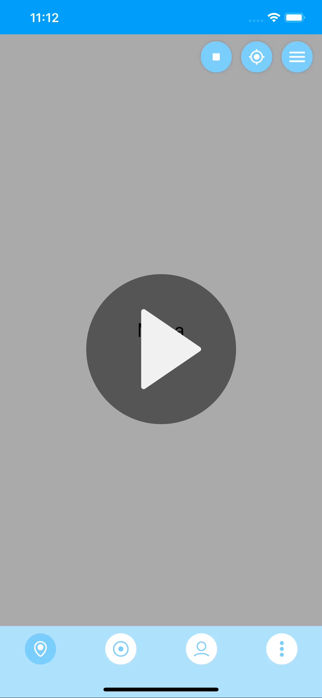
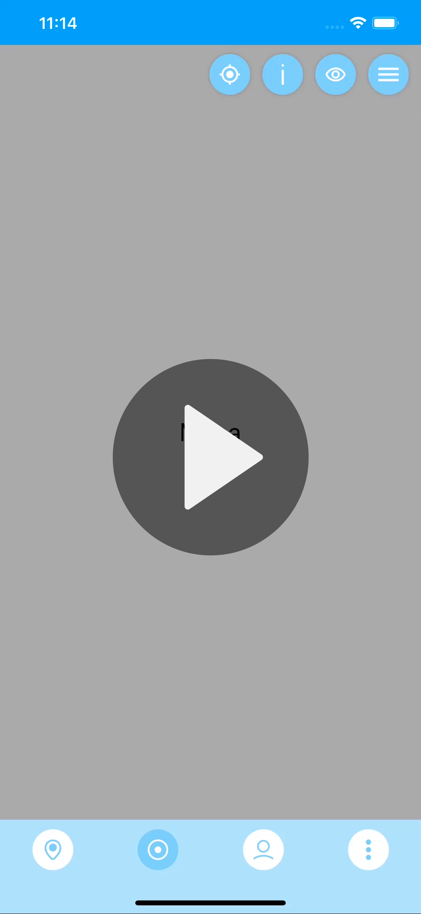

<h1>Near Chat</h1>
<h2>IOS version</h2>

<b>Main tools</b>
<ul>
<li>Firebase</li>
<li>Dynamic animations</li>
<li>Google serives, maps</li>
</ul>

<h1>Description</h1>

Design and code of a location based chat application

Nearchat (provisional name) is a location based chat concept application which let you talk with near users who join virtual chat rooms with a physical location, called Events

The app contained in this repo is an early concept, which might be developed in the future. This is the IOS version which is in a very early stage of development

<h1>Actual propotype feautures - Dynamic navigation bar animations </h1>

  
  

<h1>License</h1>

This repo acts like a portfolio and the app contained here <b>can't hold liability neither place warranty</b>. Furthermore, the final porpouse of this app is not decided yet, so in order to avoid problems in the future this repo has a <b>NonCommercial</b> CC-BY-NC license

 This work is licensed under a <a rel="license" href="http://creativecommons.org/licenses/by-nc-nd/4.0/">Creative Commons Attribution-NonCommercial-NoDerivatives 4.0 International License</a>.
